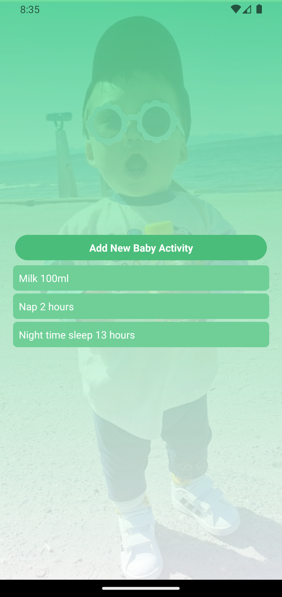

# TaskTool
#### React Native App that allows users to keep track of baby related activities like baby feed time, nap time, snack time, etc. with just one touch.
## Future features:
#### 1) Integration with Google and/or Bixby
#### 2) Auto time stamp
#### 3) Edit tasks already added
#### 4) Select from pre-curated activities

## Main

## Add Task

